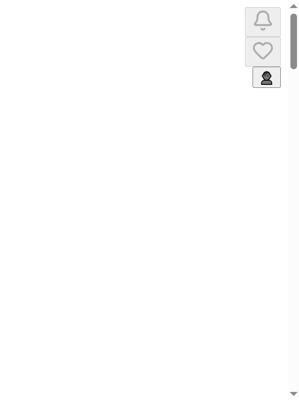

# الصفحة الرئيسية (Landing) — الكود الكامل + لقطة الشاشة

## 1) ملف `app/page.tsx` كاملاً

**المسار:** `src/app/page.tsx`

```tsx
import { HeroSection } from '@/components/landing/HeroSection';
import { QuestionsSection } from '@/components/landing/QuestionsSection';
import { CTASection } from '@/components/landing/CTASection';

export default function HomePage() {
  return (
    <main className="min-h-screen bg-cream">
      <HeroSection />
      <QuestionsSection />
      <CTASection />
    </main>
  );
}
```

---

## الـ Components والترتيب الفعلي للعرض

| الترتيب | المكوّن | المصدر | الوظيفة |
|--------|---------|--------|---------|
| 1 | **HeroSection** | `@/components/landing/HeroSection` | الهيرو: شعار، زجاجة عطر، شعار "اكتشف عطرك المثالي في ٣ دقائق" |
| 2 | **QuestionsSection** | `@/components/landing/QuestionsSection` | قسم الأسئلة الثلاثة (تشتري عطر ولا يعجبك؟ …) |
| 3 | **CTASection** | `@/components/landing/CTASection` | زر "ابدأ الرحلة" → يوجّه إلى `/quiz` |

الهيدر والفوتر **لا** يأتيان من `page.tsx`؛ يُحقَنان من **ConditionalLayout** في `layout.tsx` (يظهران فوق وتحت محتوى الصفحة).

---

## 2) لقطة الشاشة (Screenshot)

تم التقاط لقطة للصفحة من **localhost:3000** (نفس البناء المعروض على askseba.com):

- **الملف في المشروع:** `docs/landing-page-screenshot.png`
- **نسخة مؤقتة:** `c:\Users\HP\AppData\Local\Temp\cursor\screenshots\landing-page-askseba-full.png`
- **النوع:** لقطة كاملة للصفحة (Full page).

في اللقطة يظهر الهيدر (أيقونات الإشعارات، المفضلة، الحساب) في الأعلى، ثم محتوى اللاندينغ (هيرو، أسئلة، زر ابدأ الرحلة)، ثم الفوتر في الأسفل حسب الثيم والتمرير.



---

## 3) ملفات إضافية — أقسام اللاندينغ (محتوى كامل)

لا يوجد في المشروع **StatsSection.tsx** ولا **BenefitsSection.tsx**. الأقسام المستخدمة فعلياً هي الثلاثة التالية.

### HeroSection — كامل

**المسار:** `src/components/landing/HeroSection.tsx`

```tsx
// ✅ HeroSection - Fixed Version
// components/landing/HeroSection.tsx

'use client';

import { motion, useMotionValue, useTransform } from 'framer-motion';
import Image from 'next/image';
import { useState, useEffect } from 'react';

export function HeroSection() {
  const [mounted, setMounted] = useState(false);
  const mouseX = useMotionValue(0);
  const mouseY = useMotionValue(0);
  const rotateX = useTransform(mouseY, [-300, 300], [5, -5]);
  const rotateY = useTransform(mouseX, [-300, 300], [-5, 5]);

  useEffect(() => {
    setMounted(true);
  }, []);

  return (
    <section className="relative min-h-screen overflow-hidden bg-gradient-to-br from-cream via-cream to-cream/95 dark:from-surface dark:via-surface-elevated dark:to-background">
      <div className="pointer-events-none absolute inset-0 flex items-center justify-center">
        <div className="h-[600px] w-[600px] animate-pulse rounded-full bg-gradient-radial from-gold/15 via-gold/5 to-transparent dark:from-amber-500/10 dark:via-amber-500/5 dark:to-transparent blur-3xl" />
      </div>
      <div className={`pointer-events-none absolute inset-0 overflow-hidden transition-opacity duration-300 ${mounted ? 'opacity-100' : 'opacity-0'}`}>
        {mounted && [...Array(15)].map((_, i) => (
          <motion.div
            key={i}
            className="absolute h-1 w-1 rounded-full bg-gold/30 dark:bg-amber-500/20"
            initial={{ x: Math.random() * (typeof window !== 'undefined' ? window.innerWidth : 800), y: Math.random() * (typeof window !== 'undefined' ? window.innerHeight : 600) }}
            animate={{ x: Math.random() * (typeof window !== 'undefined' ? window.innerWidth : 800), y: Math.random() * (typeof window !== 'undefined' ? window.innerHeight : 600) }}
            transition={{ duration: 10 + Math.random() * 20, repeat: Infinity, ease: 'linear' }}
          />
        ))}
      </div>
      <div className="container relative z-10 mx-auto px-6">
        <h1 className="sr-only">Ask Seba</h1>
        <motion.div initial={{ opacity: 0, y: 20 }} animate={{ opacity: 1, y: 0 }} transition={{ duration: 1, delay: 0.2 }} className="pt-6 text-center bg-transparent">
          <Image src="/1769558369917_logo.png" alt="Ask Seba" width={180} height={72} priority className="mx-auto bg-transparent" />
        </motion.div>
        <motion.div
          className="relative mt-6 flex min-h-[400px] aspect-[280/400] justify-center"
          onMouseMove={(e) => {
            const rect = e.currentTarget.getBoundingClientRect();
            mouseX.set(e.clientX - rect.left - rect.width / 2);
            mouseY.set(e.clientY - rect.top - rect.height / 2);
          }}
          onMouseLeave={() => { mouseX.set(0); mouseY.set(0); }}
        >
          <motion.div
            initial={{ opacity: 0, scale: 0.8 }}
            animate={{ opacity: 1, scale: 1 }}
            transition={{ duration: 0.8, delay: 0.4, type: 'spring', stiffness: 100 }}
            style={{ rotateX, rotateY, transformStyle: 'preserve-3d' }}
            whileHover={{ scale: 1.05 }}
            className="relative cursor-pointer"
          >
            <Image src="/perfume_transparent.webp" alt="Perfume Bottle" width={280} height={400} priority sizes="(max-width: 768px) 280px, 400px" className="drop-shadow-[0_20px_40px_rgba(91,66,51,0.3)] dark:drop-shadow-[0_20px_40px_rgba(0,0,0,0.5)] ..." />
            <motion.div className="pointer-events-none absolute inset-0 rounded-full bg-gradient-radial from-gold/20 dark:from-amber-500/15 to-transparent opacity-0" whileHover={{ opacity: 1 }} transition={{ duration: 0.3 }} />
          </motion.div>
        </motion.div>
        <p className="relative z-10 mt-6 text-center text-dark-brown dark:text-amber-100 font-semibold opacity-100">اكتشف عطرك المثالي في ٣ دقائق</p>
      </div>
    </section>
  );
}
```

*(تم اختصار بعض الـ classNames في السطر الأخير للعرض؛ الملف الأصلي في المشروع كامل.)*

### QuestionsSection — كامل

**المسار:** `src/components/landing/QuestionsSection.tsx`

```tsx
// ✅ Questions Section - Fixed Mobile Width
'use client';

import { motion, Variants } from 'framer-motion';

const questions = [
  'تشتري عطر ولا يعجبك؟',
  'عندك حساسية من روائح معينة؟',
  'هل وقعت في فخ التسويق؟'
];

const containerVariants: Variants = {
  hidden: { opacity: 0 },
  visible: { opacity: 1, transition: { staggerChildren: 0.2, delayChildren: 0.3 } },
};
const itemVariants: Variants = {
  hidden: { opacity: 0, y: 30 },
  visible: { opacity: 1, y: 0, transition: { type: 'spring', stiffness: 100, damping: 12 } },
};

export function QuestionsSection() {
  return (
    <section className="py-6">
      <div className="container mx-auto px-6">
        <motion.div variants={containerVariants} initial="hidden" whileInView="visible" viewport={{ once: true, margin: '-100px' }} className="flex flex-col items-center gap-6">
          {questions.map((question, index) => (
            <motion.div
              key={index}
              variants={itemVariants}
              whileHover={{ scale: 1.02, y: -5, transition: { type: 'spring', stiffness: 300 } }}
              className="group relative w-[95%] max-w-[600px] cursor-pointer overflow-hidden rounded-2xl border border-gold/20 bg-white/70 px-8 py-5 text-center shadow-md backdrop-blur-md ..."
            >
              <div className="pointer-events-none absolute inset-0 -translate-x-full bg-gradient-to-r from-transparent via-white/40 to-transparent transition-transform duration-700 group-hover:translate-x-full" />
              <p className="relative z-10 text-[15px] font-medium text-dark-brown md:text-[17px]">{question}</p>
              <div className="absolute inset-0 rounded-2xl opacity-0 ring-2 ring-gold/50 transition-opacity duration-300 group-hover:opacity-100" />
            </motion.div>
          ))}
        </motion.div>
      </div>
    </section>
  );
}
```

### CTASection — كامل

**المسار:** `src/components/landing/CTASection.tsx`

```tsx
// ✅ CTA Section - Fixed Mobile Width
'use client';

import { motion } from 'framer-motion';
import { useRouter } from 'next/navigation';
import { useState } from 'react';
import { useTheme } from 'next-themes';

export function CTASection() {
  const router = useRouter();
  const [isClicked, setIsClicked] = useState(false);
  const { resolvedTheme } = useTheme();
  const isDark = resolvedTheme === 'dark';
  const shadowBreathing = isDark ? ['0 4px 20px rgba(120, 53, 15, 0.4)', '0 6px 30px rgba(120, 53, 15, 0.6)', '0 4px 20px rgba(120, 53, 15, 0.4)'] : ['0 4px 20px rgba(179, 157, 125, 0.4)', '0 6px 30px rgba(179, 157, 125, 0.6)', '0 4px 20px rgba(179, 157, 125, 0.4)'];
  const shadowHover = isDark ? '0 8px 30px rgba(120, 53, 15, 0.5)' : '0 8px 30px rgba(179, 157, 125, 0.5)';

  const handleClick = (e: React.MouseEvent<HTMLButtonElement>) => {
    setIsClicked(true);
    const button = e.currentTarget;
    const rect = button.getBoundingClientRect();
    const size = Math.max(rect.width, rect.height);
    const x = e.clientX - rect.left - size / 2;
    const y = e.clientY - rect.top - size / 2;
    const ripple = document.createElement('span');
    ripple.style.cssText = `position: absolute; width: ${size}px; height: ${size}px; left: ${x}px; top: ${y}px; background: rgba(255, 255, 255, 0.6); border-radius: 50%; transform: scale(0); animation: ripple-animation 0.6s ease-out; pointer-events: none;`;
    button.appendChild(ripple);
    setTimeout(() => { ripple.remove(); router.push('/quiz'); }, 300);
  };

  return (
    <section className="py-12">
      <div className="container mx-auto px-6">
        <motion.div initial={false} animate={{ opacity: 1, scale: 1 }} transition={{ duration: 0.8, delay: 0.4, type: 'spring' }} className="opacity-100 flex justify-center">
          <motion.button
            onClick={handleClick}
            disabled={isClicked}
            className="group relative w-[90%] max-w-[300px] overflow-hidden rounded-full bg-gradient-to-r from-gold to-gold-dark dark:from-amber-600 dark:to-amber-800 px-12 py-[18px] text-lg font-semibold text-white shadow-lg ..."
            animate={{ boxShadow: shadowBreathing }}
            transition={{ duration: 3, repeat: Infinity, ease: 'easeInOut' }}
            whileHover={{ scale: 1.05, y: -3, boxShadow: shadowHover, transition: { duration: 0.2 } }}
            whileTap={{ scale: 0.95 }}
          >
            <div className="pointer-events-none absolute inset-0 -translate-x-full bg-gradient-to-r from-transparent via-white/40 dark:via-white/20 to-transparent transition-transform duration-700 group-hover:translate-x-full" />
            <span className="relative z-10 text-dark-brown dark:text-amber-100 font-semibold">{isClicked ? 'جاري التحميل...' : 'ابدأ الرحلة'}</span>
          </motion.button>
        </motion.div>
      </div>
      <style jsx>{`@keyframes ripple-animation { to { transform: scale(4); opacity: 0; } }`}</style>
    </section>
  );
}
```

---

## ملخص

- **page.tsx:** قصير؛ يستورد ثلاثة مكوّنات فقط ويعرضها بالترتيب: HeroSection → QuestionsSection → CTASection.
- **StatsSection.tsx / BenefitsSection.tsx:** غير موجودين في المشروع.
- **لقطة الشاشة:** محفوظة في  
  `c:\Users\HP\AppData\Local\Temp\cursor\screenshots\landing-page-askseba-full.png`  
  (صفحة كاملة من localhost:3000).
